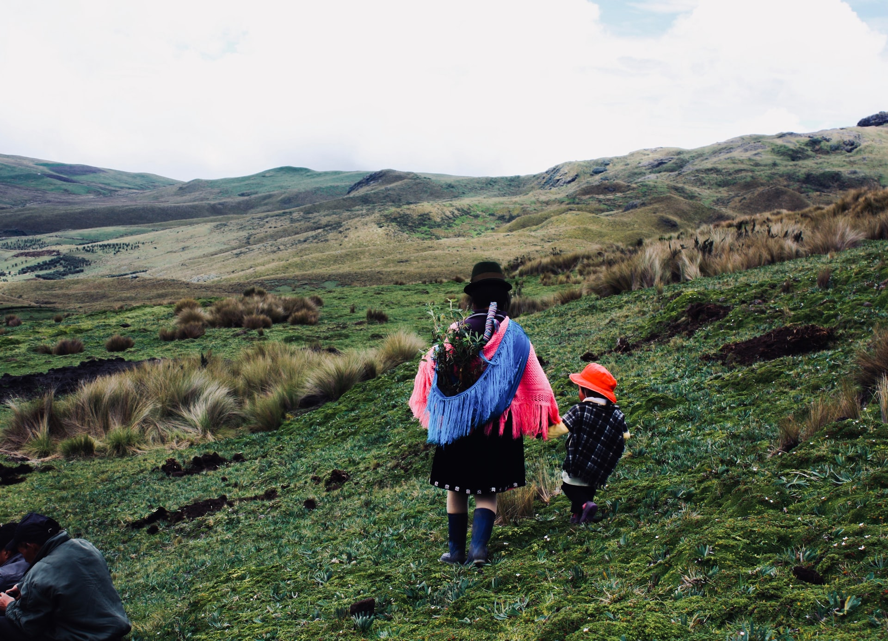

# Abyel Romero - Cano
*Aspiring Software Developer.* 

# Education
* B.Sci. Computer Science. *University of Colorado - Denver*. 2017-2022

# [Project 1: Take-N-Teach Learning Platform](https://engineering.ucdenver.edu/current-students/capstone-expo/archived-expos/sp21/csci2)

 

 
This project is an online learning platform featuring courses taught by certified instructors, pay-per-video, offline storage, email composer, etc.
* **Programming Language:** TypeScript
* **Frontend:** Ionic Framework, Angular, HTML, CSS
* **Backend:** NodeJS, ExpressJS, MongoDB, Google Cloud

Links
* **Source Code:** [https://github.com/abyel26/takenteach](https://github.com/abyel26/takenteach)
* **Project Showcase:** [https://engineering.ucdenver.edu/current-students/capstone-expo/archived-expos/sp21/csci2](https://engineering.ucdenver.edu/current-students/capstone-expo/archived-expos/sp21/csci2
)

# [Project 2: Rarámuri - Tarahumara](https://play.google.com/store/apps/details?id=raramuri.codex.com.raramuri_tarahumara&hl=en_US)

This Android app displays illustrations, and translations of words of an indigenous language of northern México. It has over 1000 downloads.
* **Programming Language:** Java

# [Project 3: Song Recommendation Based on Mood](https://github.com/abyel26/Song-Recommendation-Based-On-Mood)

This is a machine learning project that detects a person's mood from a picture. The algorithm will then make a song recommendation based on the person's mood. It uses Principal Component Analasys to detect mood and Stochastic Gradient Descent as the classification algorithm. 
* **Programming Language:** Python

**Source Code:** [https://github.com/abyel26/Song-Recommendation-Based-On-Mood](https://github.com/abyel26/Song-Recommendation-Based-On-Mood)

# [Project 4: R-Detailing](https://play.google.com/store/apps/details?id=com.rdetailing)

This is an Android application for a car detailing business. Users can view samples of detailed cars, view packages and pricing, and set up appointments.
* **Programming Language:** Java

 
